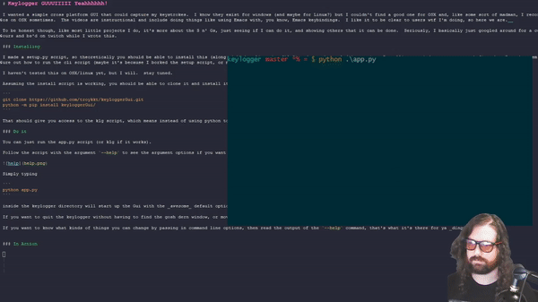

# Keylogger GUUUIIIII Yeahhhhhh!

I wanted a simple cross platform GUI that could capture my keystrokes.  I know they exist for windows (and maybe for Linux?) but I couldn't find a good one for OSX and, like some sort of madman, I record videos on OSX sometimes.  The videos are instructional and include doing things like using Emacs with, you know, Emacs keybindings.  I like it to be clear to users wtf I'm doing, so here we are.  

To be honest though, like most little projects I do, it's more about the S n' Gs, just seeing if I can do it, and showing others that it can be done.  Seriously, I basically just googled around for a couple hours and bs'd on twitch while I wrote this.

### In Action

TroyKKT *REACTS* to keyloggerGui



Change the Gui to what _YOU_ want it to be!


Make it take up the whole screen, because you're the master of your own destiny and refuse to conform to ideas of "appropriate font size"!


Use this keylogger Gui and this could be you:


### Installing

I made a setup.py script, so theoretically you should be able to install this (along with the cli script "klg") and run the tool / import it.  Installing on windows seems to work fine, but I can't seem to figure out how to run the cli script (maybe it's because I borked the setup script, or maybe it's because windows is annoying as a dev environment).

I haven't tested this on OSX/linux yet, but I will.  stay tuned.

Assuming the install script is working, you should be able to clone it and install it:

```
git clone https://github.com/troykkt/keyloggerGui.git
python -m pip install keyloggerGui/
```

That should give you access to the klg script, which means instead of using python to run these scripts, you can just type "klg"... it'll work at some point... stay tuned.

### Do it

You can just run the app.py script (or klg if it works).

Follow the script with the argument `--help` to see the argument options if you want to customize your GUI.


Simply typing 

```
python app.py
```

inside the keylogger directory will start up the Gui with the _awesome_ default options.

If you want to quit the keylogger without having to find the gosh dern window, or move your hand _all_ the way over to your mouse, then you can press shift+ctrl+x (in any order, but all at once).

If you want to know what kinds of things you can change by passing in command line options, then read the output of the `--help` command, that's what it's there for ya _dingus_.


